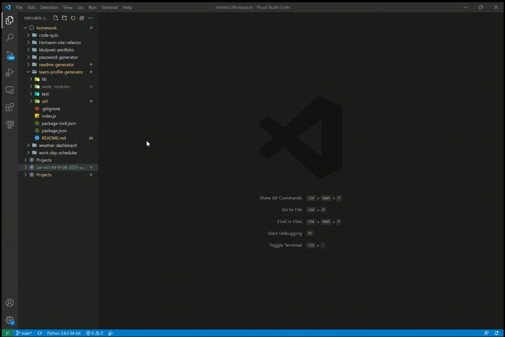
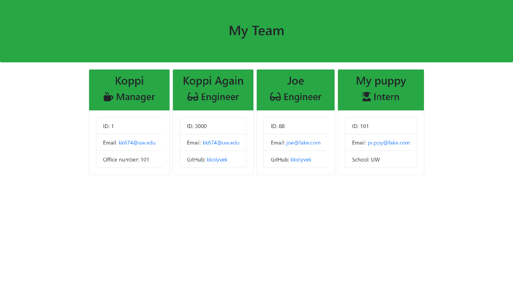

<h1 align="center"><strong>Team Profile Generator</strong></h1>

  
  

## Description

A command-line application that generates a team profile HTML file.

## Table of Contents

1. [Installation](#installation)
2. [Usage](#usage)
3. [License](#license)
4. [Contributing](#contributing)
5. [Tests](#tests)
6. [Questions](#questions)

## Installation

This application uses [Node.js](https://nodejs.org/en/) and [NPM](https://www.npmjs.com/) - both are required.

## Usage

This readme generator is a simple command line program. Once installed and ran, the user will be prompted for several details:

- Team Member Title
- Employee Name
- Employee ID Number
- Employee Email Address
- For Managers, Office Number
- For Engineers, GitHub Username
- For Interns, School Name

After each employee is added, the user will be asked whether they'd like to add another employee. Entering 'no' will be exit the program and create the HTML file. Please refer to the demo below for more clarification:

> 

Upon completion of the prompts, an `index.html` file will be created in the working directory.

> 

## License

This is free and unencumbered software released into the public domain.

Anyone is free to copy, modify, publish, use, compile, sell, or
distribute this software, either in source code form or as a compiled
binary, for any purpose, commercial or non-commercial, and by any
means.

In jurisdictions that recognize copyright laws, the author or authors
of this software dedicate any and all copyright interest in the
software to the public domain. We make this dedication for the benefit
of the public at large and to the detriment of our heirs and
successors. We intend this dedication to be an overt act of
relinquishment in perpetuity of all present and future rights to this
software under copyright law.

THE SOFTWARE IS PROVIDED "AS IS", WITHOUT WARRANTY OF ANY KIND,
EXPRESS OR IMPLIED, INCLUDING BUT NOT LIMITED TO THE WARRANTIES OF
MERCHANTABILITY, FITNESS FOR A PARTICULAR PURPOSE AND NONINFRINGEMENT.
IN NO EVENT SHALL THE AUTHORS BE LIABLE FOR ANY CLAIM, DAMAGES OR
OTHER LIABILITY, WHETHER IN AN ACTION OF CONTRACT, TORT OR OTHERWISE,
ARISING FROM, OUT OF OR IN CONNECTION WITH THE SOFTWARE OR THE USE OR
OTHER DEALINGS IN THE SOFTWARE.

For more information, please refer to <http://unlicense.org/>

---

## Contributing

If you'd like to develop this code for your own use, feel free to fork the repository!

## Tests

This repository makes use of [jest](https://jestjs.io/), an npm package for writing tests. The test folder contains several files designed to check the classes used in the code.

## Questions

For further questions and comments, please reach out through [GitHub](https://github.com/kkolyvek).
